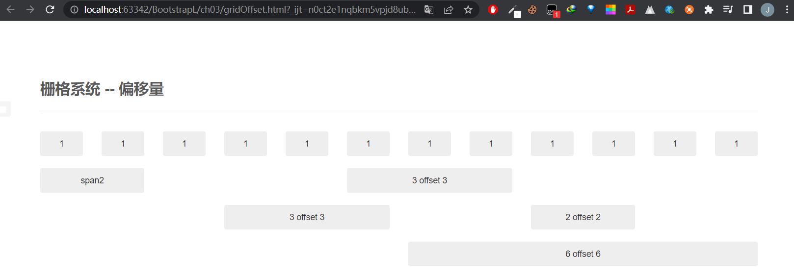

# Bootstrap 是什么？

## 初始Bootstrap

Bootstrap框架源于Twitter，基于HTML,CSS,JavaScript构建的，目前最受欢迎的前端框架。此框架包含了丰富的Web组件，设计人员可以使用这些组件快速搭建一个漂亮、功能完备的网站。同时此框架还自带多个jQuery功能插件，这些功能插件为Bootstrap框架中的组件提供了支持。

## 响应式设计

页面根据用户的终端设备尺寸或浏览器尺寸来自动进行布局调整，这就是响应式布局设计。设计的四大原则：1.移动优先还是PC优先 2. 内容流（区别于像素点） 3.位图还是矢量图（位图就是放大会失真，不失真就是矢量图svg格式） 4.相对单位还是固定单位（使用百分比，尽量不使用px,pt,cm单位）

# 开发环境

我一般轻量级选用vscode打开，一般运行要么就是open in default 浏览器，要么就是使用插件live browser，两种都可以。
大型项目可以使用webstorm来进行开发。

## 下载

一般我使用Bootstrap中文网下载 [Bootstrap 3中文网](https://www.bootcss.com/)


包含了css,js,fonts三个目录，分别代表编译好的样式文件、脚本文件、字体文件。其中带有min关键字的就是压缩好的文件（实际开发中，为了提高文件下载速度，都会选用压缩好的文件）

## 网站使用

网站使用此框架方法很简单，和引入css,js文件一样，使用scipt因为js文件，使用link引入css文件，不过注意的是，bs和js都是基于jQuery的，因此需要使用bs的js动态效果，必须引入jquery.
可以去[jQuery官网](https://jquery.com/download/)下载相应的文件。js文件放在尾部有助于提高加载速度。
引入bs还可以使用第三方CDN服务。Bs 3建议使用中文的CDN： [bs中文网的CDN](https://www.bootcdn.cn/)

## 调用样式

 **以一个表格为例** 。不使用bs或其他的框架，有以下两步：1.构思表格的样式，宽度行高等 2.编写相应的css代码，边写边调试，还要思考如何给id或者class命名，以方便审核。
如果使用bs,那么只需要引入bs，然后table加一个class = “table”就可以得到了表格格式。

```html
<link rel="stylesheet" href="../bootstrap/css/bootstrap.css" class="href">
<body>
    <table class="table">
        <tr>
            <th>No</th>
            <th>Name</th>
            <th>Age</th>
            <th>Gentle</th>
        </tr>
        <tr>
            <th>1</th>
            <th>Jacin</th>
            <th>21</th>
            <th>Man</th>
        </tr>
    </table>
    <script src="../js/jquery.js"></script>
    <!--jQuery应该放在前面优先加载-->
    <script src="../bootstrap/js/bootstrap.js"></script>
</body>
```


bs框架功能强大，提供了多种表格样式，只需要改class名字就可以了。

## 调用组件

除了添加class的方式以外，在布局方面，只要符合约定的一些class命名和嵌套，我们就可以轻松构建处一些通用的组件，以**导航条**为例：

```html
 <div class="navbar">
        <div class="navbar-inner">
            <a href="#" class="brand">Bootstrap-Narbar</a>
            <ul class="nav">
                <li class="active"><a href="#">Home</a></li>
                <li><a href="#">News</a></li>
                <li><a href="#">BBS</a></li>
            </ul>
        </div>
    </div>
```


## 调用js特效

对于bs中的js效果添加，一方面需要根据文档编写特定的html结构，另一方面调用js插件。

```html
<ul class="nav nav-tabs" id="myTab">
        <li class="active"><a href="#home" data-toggle="tab">Home</a></li>
        <li><a href="#news" data-toggle="tab">News</a></li>
        <li><a href="#blog" data-toggle="tab">Blog</a></li>
        <li><a href="#about" data-toggle="tab">About</a></li>
    </ul>
    <!-- href属性的值要和后面tab-pane中的id值对应 -->
    <div class="tab-content">
        <div class="tab-pane active" id="home">Home Page</div>
        <!--tab标签对应的内容-->
        <div class="tab-pane" id="news">News Page</div>
        <div class="tab-pane" id="blog">Blog Page</div>
        <div class="tab-pane" id="about">About Page</div>
    </div>
    <script src="../js/jquery.js"></script>
    <!--jQuery应该放在前面优先加载-->
    <script src="../bootstrap/js/bootstrap.js"></script>
```


js调用一般有两种方法，一是采用上述的自带的触发规则，在标签中添加data-toggle=“tab” 来实现，这样就不用写js代码了，另一种则是普通的jquery的调用方式：

```javascript
$('#myTab a').click(function (e) {
	e.preventDefault();
	$(this).tab('show');
}
```

# Bootstrap脚手架

脚手架，英文Scaffolding，很多译成脚手架，也有人翻译为基础架构。

## 全局样式

全局样式，就是通过Bs框架为页面设置的全局css样式表。
bs框架为屏幕、排版、链接设置了基本的全局样式，具体定义在scaffolding.less文件中，下面对部分源码进行分析：

```css
body {
	font-family : @font-family-base;
	font-size: @font-size-base;
	line-height : @line-height-base;
	color: @text-color;
	background-color: @body-bg;
}

```

## 栅格系统

栅格系统是bs框架其一特点，使用此系统会使布局更简单并且易于维护。
默认的栅格系统最多为12列，形成一个940 px 宽的容器。而且默认没有启用响应式布局。
设计一个带有基本栅格的HTML代码：创建一个类名为.row的容器，并在容器中加入合适的数量的.spanXX列即可。
代码ch03/gridOffset.html展示了偏移量的栅格布局设计，这里展示主体部分：

```html

<div class="container">
    <section id="global">
        <div class="page-header">
            <h3>栅格系统 --- 偏移列</h3>
        </div>
    </section>
    <div class="bs-docs-grid">
        <div class="bs-docs-grid">
            <div class="row show-grid">
                <div class="span1">1</div>
                <div class="span1">1</div>
                <div class="span1">1</div>
                <div class="span1">1</div>
                <div class="span1">1</div>
                <div class="span1">1</div>
                <div class="span1">1</div>
                <div class="span1">1</div>
                <div class="span1">1</div>
                <div class="span1">1</div>
                <div class="span1">1</div>
                <div class="span1">1</div>
            </div>
            <div class="row show-grid">
                <div class="span2">span2</div>
                <div class="span3 offset3">3 offset 3</div>
            </div><!-- /row -->
            <div class="row show-grid">
                <div class="span3 offset3">3 offset 3</div>
                <div class="span2 offset2">2 offset 2</div>
            </div><!-- /row -->
            <div class="row show-grid">
                <div class="span6 offset6">6 offset 6</div>
            </div><!-- /row -->
        </div>
    </div>
</div>
```

效果图


一般的栅格系统还包括有：基本栅格、带偏移列、嵌套列
